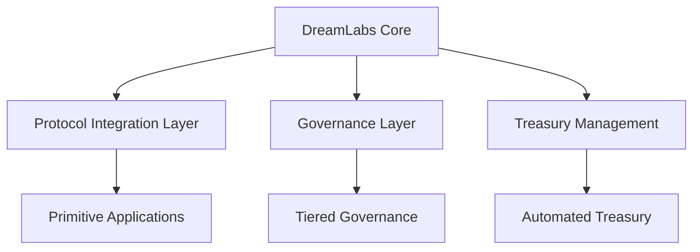
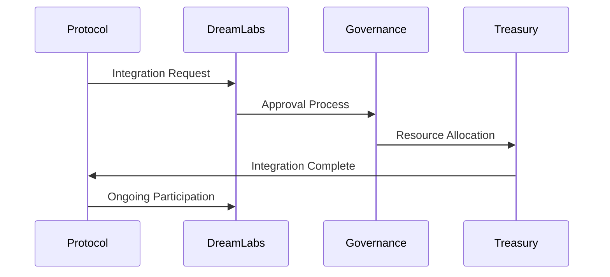

# DreamLabs Architecture

## System Overview

DreamLabs implements a modular architecture designed for scalability, security, and efficient protocol integration.



## Core Components

### 1. Protocol Integration Layer
```
Protocol Onboarding
├── Integration Contracts
├── Reward Distribution
├── Voting Power Management
└── Cross-Protocol Communication
```

### 2. Governance Layer
```
Tiered Governance
├── Emergency DAO
│   ├── Quick response
│   └── Limited powers
├── Protocol DAO
│   ├── Day-to-day operations
│   └── Regular proposals
└── Grand DAO
    ├── Major decisions
    └── Strategic changes
```

### 3. Treasury Management
```
Smart Contract Treasury
├── Operations Fund
├── Development Fund
├── Protocol Treasury
└── Community Fund
```

## Security Model

### Transaction Security
```solidity
struct TransactionTier {
    uint256 threshold;
    uint256 timelock;
    uint256 requiredApprovals;
    address[] approvers;
}

// Implementation example
contract TieredTransactions {
    mapping(uint256 => TransactionTier) public tiers;
    
    function executeTransaction(
        uint256 amount,
        bytes calldata data
    ) external {
        TransactionTier memory tier = getTierForAmount(amount);
        require(isAuthorized(msg.sender, tier), "Unauthorized");
        
        if (amount > tier.threshold) {
            scheduleTransaction(data, tier.timelock);
        } else {
            executeImmediate(data);
        }
    }
}
```

### Governance Security
- Multi-layer approval process
- Time-locked execution
- Emergency brake system
- Automated checks and balances

## Primitive Applications

### Current Primitives
1. Social Platform
   - Community engagement
   - Protocol discovery
   - Reward distribution

2. Regional Stablecoin
   - Local currency integration
   - Cross-border transactions
   - Banking interfaces

### Future Primitives
- DeFi infrastructure
- Cross-chain bridges
- Hardware integration
- Educational platforms

## Integration Flow



## Development Guidelines

### Smart Contract Standards
- Solidity version: ^0.8.0
- Comprehensive testing suite
- External audit requirements
- Documentation standards

### Integration Requirements
- Security audit completion
- Governance participation
- Treasury contribution
- Technical compatibility

## Monitoring and Maintenance

### System Health
- Transaction monitoring
- Treasury balance tracking
- Governance participation metrics
- Protocol integration status

### Emergency Procedures
1. Issue Detection
2. Emergency DAO notification
3. System pause if necessary
4. Resolution implementation
5. Post-mortem analysis

## Future Development

### Roadmap
1. Core Infrastructure
   - Basic integration system
   - Initial primitives
   - Governance framework

2. Enhancement Phase
   - Advanced primitives
   - Enhanced security
   - Expanded integration

3. Scaling Phase
   - Global expansion
   - Hardware integration
   - Full decentralization

### Research Areas
- L3 scaling solutions
- Enhanced security models
- Cross-chain integration
- Hardware solutions
